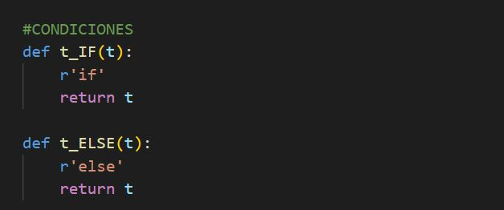

# **Manual de Tecnico Proyecto 2** 
## **Introducción**
En este documento se describe los aspectos técnicos informáticos de la aplicación de escritorio, de manera que cualquier técnico informático pueda entender y comprender la lógica dentro del programa, para así poder darle mantenimiento y actualizarla si es necesario.

Dicha aplicación ha sido desarrollada por Pablo Javier Batz Contreras estudiante de Lenguajes Formales de programación.

## **Objetivos**
Instruir al lector para el uso adecuado del código del programa, así mismo dar a conocer la lógica detrás del programa, de manera que se le facilite al lector la manipulación del código del programa.

Este programa fue realizado en Python, Visual Studio Code, HTML.

## **Conocimientos Previos**
Los conocimientos que deberán tener las personas que manejen el programa son:
- Manejo de Visual Studio Code.
-	Conocimiento de Frontend y Backend,
-	Conocimeinto de HTML.
-	Conocimiento de lenguaje Phyton..

## **Requisitos del sistema**
- CPU, Intel Core 2 Duo 2 GHz recomendado
- RAM, 2 GB recomendado 
- Espacio en el disco duro, 30 mb
- Sistema Operativo windows 7,8,9.

### **Tabla de simbolos** 
Se muestra la tabla de simbolos y caracteres utilizados.

### **Reglas establecidas** 
En esta sección, se encuentra el codigo de las reglas utilizadas para las expresiones regulares ingresadas.

### **Palabras reservadas** 
En esta sección, se encuentran las funciones utilizadas para cada palabra reservada.

## **Operaciones** 
Funciones de las operaciones a utilizar.

## **Condicionales** 
Funciones de las condicionales a utilizar.

## **Ciclos** 
Funciones de los ciclos a utilizar.

## **Comentarios** 
Funcion para poder obtener los comentarios.
